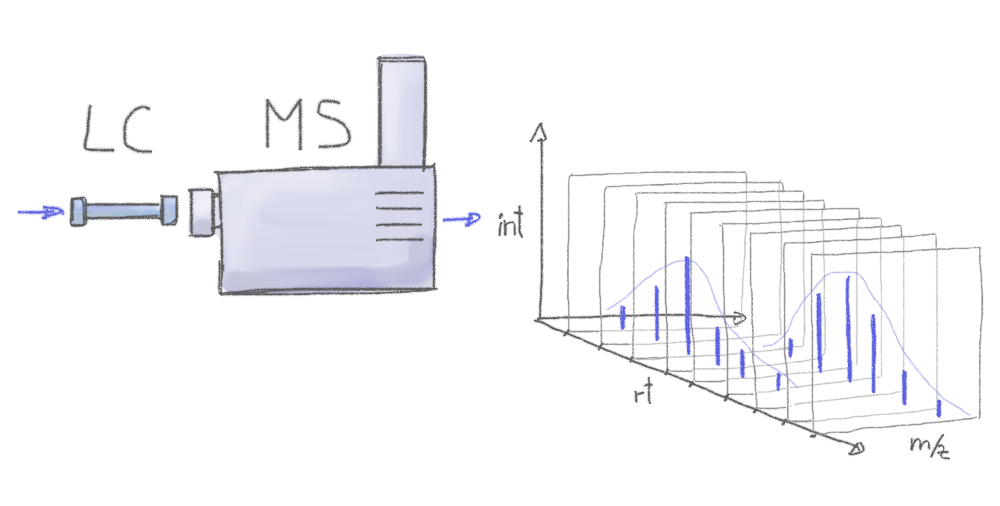
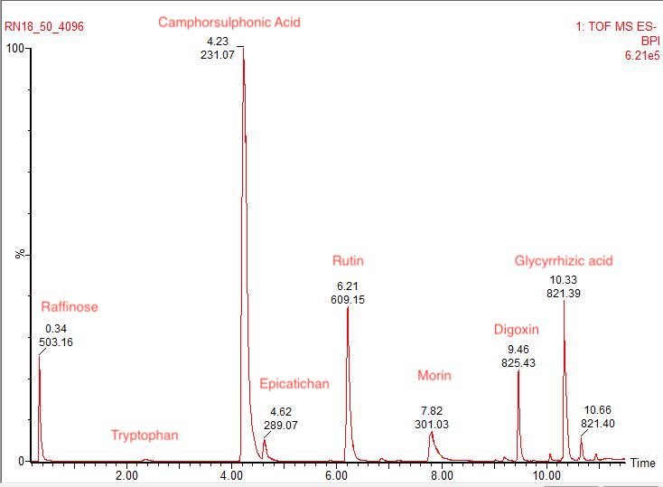

# **1.0 Goals**

The goal of this exercise is to go over preprocessing of (untargeted) LC-MS data using the xcms package (Smith et al. 2006). The preprocessing comprises chromatographic peak detection, sample alignment and peak grouping. The output will be a feature table that quantifies the intensity of each feature in each sample. The main goal of this exercize is to go over key parameters that need to be adjusted for the most important settings of the most commonly used preprocessing methods.

This excersize has been adapted from a workshop created by Johannes Rainer in 2019 (<https://jorainer.github.io/metabolomics2018/xcms-preprocessing.html#31_Data_import_and_representation>)

# **2.0 Introduction to LC-MS data**

Preprocessing of untargeted metabolomics data is the first step in the analysis of GC/LS-MS based untargeted metabolomics experiments. We go from raw LC-MS data to a feature x abundance matrix, which quantifies the signal or intensity of ions measured in each sample.

Features in LC-MS data are defined by two values, their mass to charge ratio (m/z) and the retention time (RT). Thus, the goal of XCMS is to identify and quantify all unique MZ-RT features found in a sample. In order to compare the abundance of features between samples to answer biological questions, corresponding features must be aligned and grouped across samples. The resulting two-dimensional feature by abundance matrix can then be further processed, e.g. by normalizing the data to remove sampling differences, batch effects or injection order-dependent signal drifts. Another crucial step in untargeted metabolomics analysis is the annotation of the (m/z-retention time) features to the actual ions and metabolites they represent. Note that data normalization and annotation are not covered in this document.

In order to work with LC-MS data it must be converted from vendor specific formats to an open source format, most commonly "mzXML" or "mzML" files. This is not covered in the tutorial but see proteowizard for more details - <https://proteowizard.sourceforge.io/tools/msconvert.html>) for more details on conversion.

People familiar with the concepts of mass spectrometry or LC-MS data analysis may jump directly to the next section.

## **2.1 Required Packages**

Most packages used in metabolomics are maintained via Bioconductor, and thus need to be installed with "BiocManager"

The analysis in this document requires an R version \>= 4.0.0 and recent versions of the MSnbase and xcms (version \>= 3.11.3 is needed) packages. The packages can be installed with:

```{r packages, include=FALSE}

if (!requireNamespace("BiocManager", quietly=TRUE)) { 
    install.packages("BiocManager")}


if (!requireNamespace("xcms", quietly=TRUE)) {
    BiocManager::install(version='devel')
    BiocManager::install("xcms")}


library(xcms)

if (!requireNamespace("CAMERA", quietly=TRUE)) { 
    BiocManager::install("CAMERA")}

library(xcms)


```

In this tutorial we will also use the here package in order to simpify file paths when working with R projects and R markdown files.

```{r filepaths}
if (!require(dplyr)) {install.packages('dplyr')}

library(dplyr)

if (!require(here)) {install.packages('here')}

library(here)
here()
```

## **2.2 What are LC-MS data?**

Mass spectrometry allows to measure abundances of charged molecules (ions) in a sample. Abundances are determined as ion counts for a specific mass-to-charge ratio m/z. The measured signal is represented as a ***mass*** ***spectrum***, which is composed of different ***mass peaks*** defined by their m/z with different intensities.

[](https://jorainer.github.io/metabolomics2018/xcms-preprocessing.html#31_Data_import_and_representation)

Many ions have the same or a very similar m/z making it difficult or impossible to discriminate them. MS is thus frequently coupled with a second technology to separate analytes based on other properties than their mass (or rather m/z). Common choices are gas chromatography (GC) or liquid chromatography (LC).

[](https://jorainer.github.io/metabolomics2018/xcms-preprocessing.html#31_Data_import_and_representation)

Thus, the basic unit of LC-MS data is a scan, which corresponds to a mass spectrum at a specific time point. Each spectrum contains the relative abundance of each m/z (ion) at that specific instance or scan. LC-MS data is therefore a **time series of mass spectra**. By coupling the RT and the m/z values we are able to separate metabolites that would otherwise be indistinguishable based only on their m/z values.

Understanding what LC-MS data are is useful for the rest of this excessive, because the preprocessing steps of untargeted metbolomics analysis are specifically designed to convert a time series of spectra, into a feature x abundance matrix. Knowing the structure of the data makes setting key parameters much more intuitive.

## **2.3 Definitions and common naming convention**

Naming conventions and terms used in this document are:

-   [*mass spectrum*]{.underline}: relative count abundance of all ions (m/z) values observed at a single time point or scan. Each ion in a spectrum is represented by a mass peak.

[insert image]

-   [*chromatographic peak*]{.underline}: peak containing the signal from an ion (m/z value) in retention time dimension.

[insert image]

-   [*feature*]{.underline}: chromatographic peaks (defined by m/z and RT) grouped across files.

# 3.0 Workflow: Metabolomics data preprocessing using xcms

We go through the following steps:

1)  data handling (I/O) of mass spectrometry data, which relies on the MSnbase package. (Section 3.1)

2)  [*chromatographic peak detection*]{.underline}: process in which chromatographic peaks are identified within each file. (Section 3.3)

3)  [*retention time alignment*]{.underline}: process that adjusts for retention time differences between measurements/files. (Section 3.4)

4)  [*correspondence*]{.underline}: grouping of chromatographic peaks (presumably from the same ion) across files (Section 3.5)

5)  [*gap filling*]{.underline}: Once all features have been identified across all samples, we quantify their abundance in each sample (Section 3.6)

## 3.1 Data important

### The dataset

The example data set of this workflow consists of five files in mzML format with signals from retention time index (RTI) samples. An RTI is a type of external standard containing known compounds that are run at the start, in the middle and at the end of an experiment. The RTI is then used to track machine variation across the run in terms of shift in retention time and mass signal.



The RTI in this dataset is composed of 9 compounds that span a range of molecular weights and polarity.

| Compound Name           | m/z (M-H) | retention time (seconds) |
|-------------------------|-----------|--------------------------|
| Raffinose               | 503.1618  | 20                       |
| Tryptophan              | 203.0826  | 141.6                    |
| Camphorsulfonic acid    | 231.0697  | 253.8                    |
| Epicatichan             | 289.0718  | 277.2                    |
| Rutin                   | 609.1469  | 372.6                    |
| Morin                   | 301.0354  | 469.2                    |
| Digoxin (formate aduct) | 825.4267  | 567.6                    |
| Glycyrrhizic acid       | 821.3965  | 619.8                    |

Working with a set of known compounds is useful, because it offers us a clear sense of what a good chromatographic peak or feature looks like in our dataset and thus can be used to set important parameters. Moreover, because this QC is independent of the samples of interest, it can be run between experiments and used to track the long term stability of an the instrument.

Some details about the data:

Data were acquired on a Waters Xevo G2 QToF coupled to an Waters Acquity I-Class UPLC with a waters 2.1 x 50 mm BEH C18 column. Data were aquired in negative ionization mode. A 15 minute reverse-phase gradient was used with water (0.1% formic acid) as the mobile phase and acetonitrile (0.1% formic acid) as the stationary phase.

### Data import

In the code block below we first define the location of the mzML files, which are part of the `msdata` package. We also define a `data.frame` describing the samples/experiment and pass this to the `readMSData` function which imports the data. The option `mode = "onDisk"` tells the function to read only general metadata into memory. The m/z and intensity values are not imported but retrieved from the original files on demand, which enables also analyses of very large experiments.

```{r}

datafiles <- list.files(here("data","standards"),pattern = ".mzML",full.names = TRUE) 

pd <- data.frame(file = basename(datafiles),
                 injection_idx = 1:5,
                 sample = gsub(".mzML","",basename(datafiles)),
                 group = "RTI")

rawData <- readMSData(datafiles, pdata = new("NAnnotatedDataFrame", pd), centroided. = TRUE,mode= "onDisk", verbose=T)

rawData


```

The MS experiment data is now represented as an `OnDiskMSnExp` object. Phenotype information can be retrieved with the `pData` function, single columns in the phenotype table using `$`. Below we access sample descriptions.

```{r}


pData(rawData)
```

## 3.2 **Chromatographic peak detection**

Chromatographic peak detection aims to identify peaks along the retention time axis that represent the signal from individual compounds' ions.

***What is a chromatographic peak?***

Remember, LC-MS data are a time-series of mass spectra. A cromatographic peak, thus can be identified when a single mass (m/z value) appears repeatedly across multiple scans. It's abundance accross scans should also follow a normal distritbution rising and then falling in abundance forming a peak shape.

We can see this happening if we stitch together the individual scans between 365 and 385 seconds:

Run the entire box of code bellow and click through each scan that is plotted. NOTICE how the scale on the y axis changes dramatically as ion intensity peaks.

```{r}
# Get all the spectra between a retention time window.
#subset
single_data_file <- filterFile(
  rawData,1)

sps <- single_data_file %>%
    filterRt(rt = c(365, 385)) %>%
    spectra 

#The result is a list of Spectrum objects. Below we determine the number of spectra we have got
length(sps)

plot(sps[[1]])
plot(sps[[10]])
plot(sps[[20]])
plot(sps[[30]])
plot(sps[[40]])
plot(sps[[50]])
plot(sps[[60]])
plot(sps[[70]])
plot(sps[[80]])


```

A chromatographic peak can be visualized when we sum the intensity within an MZ window across multiple scans and plot it against time. We call this a chromatogram

```{r}
rutin_chr <- chromatogram(single_data_file, rt = c(350, 400),
                        mz = c(609.00, 609.2),
                        aggregationFun = "max")
#' Plot the data

plot(rutin_chr)
```

**The findChromPeaks function:**

This can be performed with the `findChromPeaks` function and one of the available algorithms that can be configures with the respective parameter object: passing a `MatchedFilterParam` to `findChromPeaks` performs peak detection as described in the original xcms article (Smith et al. 2006). With `CentWaveParam` a continuous wavelet transformation (CWT)-based peak detection is performed that can detect close-by and partially overlapping peaks with different (retention time) widths (Tautenhahn, Böttcher, and Neumann 2008).

We use the *centWave* algorithm that performs peak detection in two steps: first it identifies *regions of interest* in the m/z - retention time space and subsequently detects peaks in these regions using a continuous wavelet transform (see the original publication for more details). The algorithm can be configured with several parameters (see `?CentWaveParam`), the most important ones being `peakwidth` and `ppm` and defining the intensity relative to `noise` or `snthresh`

```{r}
?CentWaveParam
```

Lets start by apply thing the default CentwaveParam values and seeing what happens

```{r}
#' Get default centWave parameters
cwp <- CentWaveParam()

#' "dry-run" peak detection on the XIC.
res <- findChromPeaks(rutin_chr, param = cwp)
chromPeaks(res)
```

No peaks were identified by the call above. Looking at the default values for the centWave parameters helps understanding why peak detection failed:

```{r}
cwp

```

The default settings for `peakwidth` are 20 to 50 seconds, while from the plot above it is apparent that the chromatographic peak for Rutin is about 6 seconds wide. Below we adapt the settings to accommodate peaks ranging from 2 to 10 seconds and re-run the peak detection. In general, it is advised to investigate peak widths for several ions in the data set to determine the most appropriate `peakwidth` setting. Note that we use also `integrate = 2` which uses a different way to define the peak borders that can (as in the present case) result in better peak boundary estimates (try with the default `integrate = 1` to compare the difference).

**Defining `peakwidth` parameter:**

```{r}

cwp <- CentWaveParam(peakwidth = c(3, 10), integrate = 2)

rutin_chr <- findChromPeaks(rutin_chr, param = cwp)

#' Plot the data and higlight identified peak area
plot(rutin_chr)

```

```{r}
chromPeaks(rutin_chr)
```

The `matrix` returned by `chromPeaks` contains the retention time and m/z range of the peak (`"rtmin"`, `"rtmax"`, as well as the integrated peak area (`"into"`), the maximal signal (`"maxo"`) and the signal to noise ratio (`"sn"`).

**Defining** `ppm` **parameter:**

Another important parameter for centWave is `ppm` which is used in the initial identification of the regions of interest. In contrast to random noise, the *real* signal from an ion is expected to yield stable m/z values in consecutive scans (the scattering of the m/z values around the *real* m/z value of the ion is supposed to be inversely related with its intensity). In centWave, all data points that differ by less than `ppm` in consecutive spectra are combined into a region of interest that is then subject to the CWT-based peak detection (same as performed above on the XIC). To illustrate this, we plot the data for Rutin with the option `type = "XIC"`.

```{r}

rutin <- single_data_file %>%
    filterRt(rt = c(368, 376)) %>%
    filterMz(mz = c(609.0, 609.2))


#' Plot the data
plot(rutin, type = "XIC") 


```

We next calculate the differences in m/z values between consecutive scans in this file.

```{r}

#' Extract the Rutin data a data.frame
rutin_df <- as(rutin, "data.frame")

#' The difference between m/z values from consecutive scans expressed
#' in ppm
summary(diff(rutin_df$mz) * 1e6 / mean(rutin_df$mz))

head(diff(rutin_df$mz) * 1e6 / mean(rutin_df$mz),40)


```

The difference in m/z values for the Rutin data is thus \~ 8 ppm. This should ideally be evaluated for several compounds and should be set to a value that allows to capture the full chromatographic peaks for most of the tested compounds. We can next perform the peak detection using our settings for the `ppm` and `peakwidth` parameters.

**Defining signal intensity parameters** `noise` **and** `snthresh` **parameters:**

Let's look at a lower intensity peak in our chromatogram. Tryptophan comes out between 135 and 150 seconds.

```{r}
Trypt_chr <- chromatogram(single_data_file, rt = c(130, 160),
                        mz = c(203, 204),
                        aggregationFun = "max")
#' Plot the data
plot(Trypt_chr)
```

The intensity of Tryptophan only rises to about 20,000. We know it is not noise because we added it to our mix of standards, and thus should be able to detect it. To do so we're going to have to adjust the signal intensity parameters `noise` and `snthresh`

`noise` relates to the minimum intensity required for centroids to be considered in the first analysis step (centroids with intensity `< noise` are omitted from ROI detection). Effectively, we need to know the baseline value of mass spectrometer where peaks are only noise.

To see the baseline we can look at an area where no peaks exist. Between Tryptophan and Camphorsulfonic Acid there is a large gap with no peaks (200 to 225 seconds)

```{r}

# Get all the spectra between a retention time window.

sps <- single_data_file %>%
    filterRt(rt = c(200, 225)) %>%
    spectra 


plot(sps[[50]])

```

We see that there are a mass peaks at almost every position on the mz window. All of these values are below 200.

For comparison look at a single scan again when Tryptophan is most abundance around 136 seconds

```{r}

# Get all the spectra between a retention time window.

sps <- single_data_file %>%
    filterRt(rt = c(135, 136)) %>%
    spectra 


plot(sps[[1]])

```

Even the smaller peaks come out at around 2500.

A very conservative threshold for the `noise` parameter can therefor be 500.

Lets apply this and test if we pick up Ttrypophan

```{r}

cwp <- CentWaveParam(peakwidth = c(3, 10), integrate = 2, noise = 500)


Trypt_chr <- findChromPeaks(Trypt_chr, param = cwp)

#' Plot the data and higlight identified peak area
plot(Trypt_chr)


```

Unfortunately, no peaks were detected. We can adjust the signal to noise threshold parameter and see if we can pick it up. For simplicity. We will set it to 0 and then use the chromPeaks() function to see what snthresh value was read.

We also have to adjust the width of the peak because this is a wider peak

```{r}

cwp <- CentWaveParam(peakwidth = c(4, 10),ppm=15, integrate = 2, noise = 2, snthresh = 0)


Trypt_chr <- findChromPeaks(Trypt_chr, param = cwp)

#' Plot the data and higlight identified peak area
plot(Trypt_chr)

```

```{r}

chromPeaks(Trypt_chr)

```

We can see that we will need a minimum SN of 3 in order for this peak to be detected.

### 3.2.1 Peak Picking Exercise:

It's a good idea to test out these parameters with more peaks to make sure our peakpicking picks up all the peaks we are interested in.

Use the following chunks of code to fill out the rest of this table with appriate values.

|      Compound Name      | retention time (S) | m/z (M-H) | Peak Width (s) | Average PPM error | SN Ratio |            Notes            |
|:---------:|:---------:|:---------:|:---------:|:---------:|:---------:|:---------:|
|        Raffinose        |         20         | 503.1618  |                |                   |          | This is a very narrow peak! |
|       Tryptophan        |       141.6        | 203.0826  |      3-4       |        14         |    3     |                             |
|  Camphorsulfonic acid   |     230 to 250     | 231.0697  |                |                   |          |  This is a very wide peak!  |
|       Epicatichan       |       277.2        | 289.0718  |                |                   |          |                             |
|          Rutin          |       372.6        | 609.1469  |       6        |         8         |   424    |                             |
| Digoxin (formate aduct) |       567.6        | 825.4267  |                |                   |          |                             |

**Raffinose:**

```{r}


#starting parameters
cwp <- CentWaveParam(peakwidth = c(2, 10), ppm=15, integrate = 2, noise=500, snthresh=0)

#adjust the RT and MZ windows to visualize Raffinose, Camphorsulfonic acid and Epicatichan
rt_min = 15
rt_max = 23
mz_min = 503
mz_max = 504


single_peak_chr <- chromatogram(single_data_file, rt = c(rt_min, rt_max),
                        mz = c(mz_min, mz_max),
                        aggregationFun = "max")

single_peak_chr <- findChromPeaks(single_peak_chr, param = cwp)

#' Plot the data and higlight identified peak area
plot(single_peak_chr)


chromPeaks(single_peak_chr)
print("")
print("")

#' Extract the Rutin data a data.frame

single_peak <- single_data_file %>%
    filterRt(rt = c(rt_min, rt_max)) %>%
    filterMz(mz = c(mz_min, mz_max))

single_peak_chr_df <- as(single_peak, "data.frame")
#' The difference between m/z values from consecutive scans expressed
#' in ppm
summary(diff(single_peak_chr_df$mz) * 1e6 / mean(single_peak_chr_df$mz))
print("")
print("")
head(diff(single_peak_chr_df$mz) * 1e6 / mean(single_peak_chr_df$mz),40)


```

**Camphorsulfonic acid:**

#note we have to use minpeak width = 2 based on the narrowness of raffinose.

#If adjust down peak width, width to 10 we pick up both parts, and we'll have to merge them later

```{r}

#starting parameters
cwp <- CentWaveParam(peakwidth = c(2, 10), ppm=15, integrate = 2, noise=500, snthresh=0)

#adjust the RT and MZ windows to visualize Raffinose, Camphorsulfonic acid and Epicatichan
rt_min = 225
rt_max = 260
mz_min = 230.9
mz_max = 231.3


single_peak_chr <- chromatogram(single_data_file, rt = c(rt_min, rt_max),
                        mz = c(mz_min, mz_max),
                        aggregationFun = "max")

single_peak_chr <- findChromPeaks(single_peak_chr, param = cwp)

#' Plot the data and higlight identified peak area
plot(single_peak_chr)


chromPeaks(single_peak_chr)

print("")
print("")

#' Extract the Rutin data a data.frame

single_peak <- single_data_file %>%
    filterRt(rt = c(rt_min, rt_max)) %>%
    filterMz(mz = c(mz_min, mz_max))

single_peak_chr_df <- as(single_peak, "data.frame")
#' The difference between m/z values from consecutive scans expressed
#' in ppm
summary(diff(single_peak_chr_df$mz) * 1e6 / mean(single_peak_chr_df$mz))
print("")
print("")
head(diff(single_peak_chr_df$mz) * 1e6 / mean(single_peak_chr_df$mz),40)

```

**Epicatichan:**

```{r}

#starting parameters
cwp <- CentWaveParam(peakwidth = c(2, 10), ppm=15, integrate = 2, noise=500, snthresh=0)

#adjust the RT and MZ windows to visualize Raffinose, Camphorsulfonic acid and Epicatichan
rt_min = 270
rt_max = 285
mz_min = 289
mz_max = 290


single_peak_chr <- chromatogram(single_data_file, rt = c(rt_min, rt_max),
                        mz = c(mz_min, mz_max),
                        aggregationFun = "max")


single_peak_chr <- findChromPeaks(single_peak_chr, param = cwp)

#' Plot the data and higlight identified peak area
plot(single_peak_chr)

chromPeaks(single_peak_chr)
print("")
print("")

#' Extract the Rutin data a data.frame

single_peak <- single_data_file %>%
    filterRt(rt = c(rt_min, rt_max)) %>%
    filterMz(mz = c(mz_min, mz_max))

single_peak_chr_df <- as(single_peak, "data.frame")
#' The difference between m/z values from consecutive scans expressed
#' in ppm
summary(diff(single_peak_chr_df$mz) * 1e6 / mean(single_peak_chr_df$mz))
print("")
print("")
head(diff(single_peak_chr_df$mz) * 1e6 / mean(single_peak_chr_df$mz),40)

```

**Digoxin (formate aduct):**

```{r}

#starting parameters
cwp <- CentWaveParam(peakwidth = c(2, 10), ppm=15, integrate = 2, noise=500, snthresh=0)

#adjust the RT and MZ windows to visualize Raffinose, Camphorsulfonic acid and Epicatichan
rt_min = 560
rt_max = 570
mz_min = 825
mz_max = 826


single_peak_chr <- chromatogram(single_data_file, rt = c(rt_min, rt_max),
                        mz = c(mz_min, mz_max),
                        aggregationFun = "max")


single_peak_chr <- findChromPeaks(single_peak_chr, param = cwp)

#' Plot the data and higlight identified peak area
plot(single_peak_chr)

chromPeaks(single_peak_chr)
print("")
print("")

#' Extract the Rutin data a data.frame

single_peak <- single_data_file %>%
    filterRt(rt = c(rt_min, rt_max)) %>%
    filterMz(mz = c(mz_min, mz_max))

single_peak_chr_df <- as(single_peak, "data.frame")
#' The difference between m/z values from consecutive scans expressed
#' in ppm
summary(diff(single_peak_chr_df$mz) * 1e6 / mean(single_peak_chr_df$mz))
print("")
print("")
head(diff(single_peak_chr_df$mz) * 1e6 / mean(single_peak_chr_df$mz),40)


```

Answers:

|      Compound Name      | retention time (S) | m/z (M-H) | Peak Width (s) | Average PPM error | SN Ratio |            Notes            |
|:---------:|:---------:|:---------:|:---------:|:---------:|:---------:|:---------:|
|        Raffinose        |         20         | 503.1618  |       2        |         9         |    3     | This is a very narrow peak! |
|       Tryptophan        |       141.6        | 203.0826  |       4        |        14         |    3     |       Low, wide peak        |
|  Camphorsulfonic acid   |     230 to 250     | 231.0697  |       3        |        13         |    2     |  This is a very wide peak!  |
|       Epicatichan       |       277.2        | 289.0718  |       6        |         3         |    12    |                             |
|          Rutin          |       372.6        | 609.1469  |       6        |         8         |   424    |                             |
| Digoxin (formate aduct) |       567.6        | 825.4267  |       4        |         7         |    3     |                             |

Note, we have to pick a compromise vale for peak width. We will not pick up Raffinose unless we set it as low as 2. But if we set it as low as 2, we do not integrate across the full peak for Trypophan or Camphorsulfonic acide. I would compromise to pick up Raffinose because it atleast picks up part of all peaks.

**Now that we have defines the appropriate peak picking parameters we can pick peaks in all samples and move onto the next section**

```{r}

cwp <- CentWaveParam(peakwidth = c(2, 10), ppm=15, integrate = 2, noise=500, snthresh=0)

rawData <- findChromPeaks(rawData, param = cwp)

```

## [*3.3 retention time alignment:*]{.underline}

### [*3.3.1 Why do alignment?*]{.underline}

Thus far we have only looked at peaks from a single injection or file.

If we plot 4 of the standards for all 5 injections of the RTI we can see that the peaks from the different samples don't perfectly line up.There is about a 10 second shift for one of the samples.

While chromatography helps to discriminate better between analyses it is also affected by variances that can lead to shifts in retention times between measurement runs. The alignment step aims to adjust these retention time differences between samples within an experiment.

```{r}


register(SerialParam(), default=TRUE)


bpc_raw <- chromatogram(rawData, aggregationFun = "max",rt = c(0, 700))
plot(bpc_raw, peakType = "none")
```

You can see that there are some RT shifts across these samples.

If we zoom in on the standards we worked with before you can see these shifts more clearly

```{r}

par(mfrow = c(2, 2))

#1 Rutin
rt_min = 350
rt_max = 400
mz_min = 609.00 
mz_max = 609.2

rutin_chr <- chromatogram(rawData, rt = c(rt_min, rt_max),
                        mz = c(mz_min, mz_max),
                        aggregationFun = "max")
plot(rutin_chr,peakType = "none", main="Rutin")

#2 epichatichin
rt_min = 270
rt_max = 290
mz_min = 289
mz_max = 290

epi_chr <- chromatogram(rawData, rt = c(rt_min, rt_max),
                        mz = c(mz_min, mz_max),
                        aggregationFun = "max")
plot(epi_chr,peakType = "none", main="Epichatichin")

#3 Camphorsulfonic acid
rt_min = 200
rt_max = 300
mz_min = 230.9
mz_max = 231.3

cam_chr <- chromatogram(rawData, rt = c(rt_min, rt_max),
                        mz = c(mz_min, mz_max),
                        aggregationFun = "max")
plot(cam_chr,peakType = "none", main="Camphorsulfonic Acid")


#4 Digoxin
rt_min = 550
rt_max = 580
mz_min = 825
mz_max = 826

Dig_chr <- chromatogram(rawData, rt = c(rt_min, rt_max),
                        mz = c(mz_min, mz_max),
                        aggregationFun = "max")
plot(Dig_chr,peakType = "none", main="Digoxin")


```

We can see that for Rutin and Epichatichin there is a shift for one of the samples, but RT seem fairly stable for Camphorsulfonic Acid and Digoxin.

#PeakGroups Alignment

Alignment can be performed with `xcms` using the `adjustRtime` function that supports the *peakGroups* (Smith et al. 2006) and the *obiwarp* (Prince and Marcotte 2006) method. The settings for the algorithms can be defined with the `PeakGroupsParam` and the `ObiwarpParam` parameter objects, respectively. Note also that `xcms` supports now a *subset-based* alignment which would allow to align a whole data set based on retention time shift adjustments estimated on e.g. QC samples. See the `xcms` [vignette](https://bioconductor.org/packages/release/bioc/vignettes/xcms/inst/doc/xcms.html) for more information. The subset-based is very useful for large datasets because alignment can be very memory intensive, and sometimes fails when samples do not share enough peaks.

For our example we use the peakGroups method that aligns samples based on the retention times of *hook peaks*, which should be present in most samples and which, because they are supposed to represent signal from the same ion species, can be used to estimate retention time shifts between samples. Prior to the alignment we thus have to group peaks across samples, which is accomplished by the *peakDensity* correspondence analysis method. Details about this method and explanations on the choices of its parameters are provided in the next section. After having performed this initial correspondence analysis, we perform the alignment using settings `minFraction = 1` and `span = 0.6`. `minFraction` defines the proportion of samples in which a candidate hook peak has to be detected/present. A value of 0.9 would e.g. require for a hook peak to be detected in in 90% of all samples of the experiment. Our data represents replicated measurements of the same sample pool and we can therefore require hook peaks to be present in each file. The parameter `span` defines the degree of smoothing of the loess function that is used to allow different regions along the retention time axis to be adjusted by a different factor. A value of 0 will most likely cause overfitting, while 1 would perform a constant, linear shift. Values between 0.4 and 0.6 seem to be reasonable for most experiments.

```{r}

#' Define the settings for the initial peak grouping - details for
#' choices in the next section.
pdp <- PeakDensityParam(sampleGroups = pData(rawData)$group, bw = 30,
                        minFraction = 1, binSize = 0.05)

rawData <- groupChromPeaks(rawData, pdp)


#' Define settings for the alignment
pgp <- PeakGroupsParam(minFraction = 1, span = 0.6)
rawData <- adjustRtime(rawData, param = pgp) 


```

The following plots how much RT was moved across the chromatogram

```{r}

par(mfrow = c(2, 1))
#' Plot the raw base peak chromatogram
plot(bpc_raw, peakType = "none")
#' Plot the BPC after alignment
plot(chromatogram(rawData, aggregationFun = "max", include = "none",rt = c(0, 700)))


#' Plot the difference between raw and adjusted retention times
#plotAdjustedRtime(rawData)

```

```{r}
par(mfrow = c(2, 2))

#1 Rutin
rt_min = 350
rt_max = 400
mz_min = 609.00 
mz_max = 609.2

rutin_chr <- chromatogram(rawData, rt = c(rt_min, rt_max),
                        mz = c(mz_min, mz_max),
                        aggregationFun = "max")
plot(rutin_chr,peakType = "none", main="Rutin")

#2 epichatichin
rt_min = 270
rt_max = 290
mz_min = 289
mz_max = 290

epi_chr <- chromatogram(rawData, rt = c(rt_min, rt_max),
                        mz = c(mz_min, mz_max),
                        aggregationFun = "max")
plot(epi_chr,peakType = "none", main="Epichatichin")

#3 Camphorsulfonic acid
rt_min = 200
rt_max = 300
mz_min = 230.9
mz_max = 231.3

cam_chr <- chromatogram(rawData, rt = c(rt_min, rt_max),
                        mz = c(mz_min, mz_max),
                        aggregationFun = "max")
plot(cam_chr,peakType = "none", main="Camphorsulfonic Acid")


#4 Digoxin
rt_min = 550
rt_max = 580
mz_min = 825
mz_max = 826

Dig_chr <- chromatogram(rawData, rt = c(rt_min, rt_max),
                        mz = c(mz_min, mz_max),
                        aggregationFun = "max")
plot(Dig_chr,peakType = "none", main="Digoxin")
```

Now you can see all of these standards Align well.

## **3.4 Correspondence (Peak Grouping)**

The final step of the LC-MS preprocessing with `xcms` is the correspondence analysis, in which chromatographic peaks from the same ion are grouped across samples to form a *feature*. `xcms` implements two methods for this purpose: *peak density* (Smith et al. 2006) and *nearest* (Katajamaa, Miettinen, and Oresic 2006) that can be configured by passing either a `PeakDensityParam` or a `NearestPeaksParam` object to the `groupChromPeaks` function. For our example we use the *peak density* method that iterates through m/z slices in the data and groups chromatographic peaks to features in each slice (within the same or across samples) depending on their retention time and the distribution of chromatographic peaks along the retention time axis. Peaks representing signal from the same ion are expected to have a similar retention time and, if found in many samples, this should also be reflected by a higher peak density at the respective retention time.

To illustrate this we extract below an m/z slice containing the Rutin peak and use the `plotChromPeakDensity` function to visualize the distribution of peaks along the retention time axis and to *simulate* a correspondence analysis based on the provided settings.

```{r}


#' Get default parameters for the grouping
pdp <- PeakDensityParam(sampleGroups = pData(rawData)$group)

bpc_rutin <- chromatogram(rawData, mz = c(289.06, 289.08),
                           aggregationFun = "max")

#' Dry-run correspondence and show the results.
plotChromPeakDensity(bpc_rutin, param = pdp)


```

```{r}

#' Get default parameters for the grouping
pdp <- PeakDensityParam(sampleGroups = pData(rawData)$group)

bpc_glyc <- chromatogram(rawData, mz = c(821.3, 821.5),rt = c(500, 700),
                           aggregationFun = "max")

#' Dry-run correspondence and show the results.
plotChromPeakDensity(bpc_glyc, param = pdp)

```

```{r}

```

The upper panel in the plot above shows the chromatographic data with the identified peaks. The lower panel shows the retention time of identified peaks (x-axis) per sample (y-axis) with the black solid line representing their distribution along the x-axis. Peak groups (features) are indicated with grey rectangles. The peak density correspondence method groups all chromatographic peaks under the same *density peak* into a feature. With the default settings we were able to group the Rutin peak of each sample into a feature. The parameters for the peak density correspondence analysis are:

-   `binSize`: m/z width of the bin/slice of data in which peaks are grouped.

-   `bw` defines the smoothness of the density function.

-   `maxFeatures`: maximum number of features to be defined in one bin.

-   `minFraction`: minimum proportion of samples (of one group!) for which a peak has to be present.

-   `minSamples`: minimum number of samples a peak has to be present.

The parameters `minFraction` and `minSamples` depend on the experimental layout and should be set accordingly. `binSize` should be set to a small enough value to avoid peaks from different ions, but with similar m/z and retention time, being grouped together. The most important parameter however is `bw` and, while its default value of 30 was able to correctly group the Serine peaks, it should always be evaluated on other, more complicated, signals too. Below we evaluate the performance of the default parameters on an m/z slice that contains signal from multiple ions with the same m/z, including isomers Betaine and Valine ([M+H]+ m/z 118.08625).

```{r}
pdp <- PeakDensityParam(sampleGroups = pData(rawData)$group, bw=4, binSize=0.25, minSamples=1, minFraction = 0.001)

bpc_glyc <- chromatogram(rawData, mz = c(821.3, 821.5),rt = c(500, 700),aggregationFun = "max")

#' Dry-run correspondence and show the results.
plotChromPeakDensity(bpc_glyc, param = pdp)

```

Despite being very close, chromatographic peaks of isomers were successfully grouped into separate features.

```{r}
pdp <- PeakDensityParam(sampleGroups = pData(rawData)$group, bw=4, binSize=0.25, minSamples=1, minFraction = 0.001)

rawData <- groupChromPeaks(rawData, param = pdp) 

```

## 3.5 Gap Filling

Results from the correspondence analysis can be accessed with the `featureDefinition` function. This function returns a data frame with the retention time and m/z ranges of the apex positions from the peaks assigned to the feature and their respective indices in the `chromPeaks` matrix.

```{r}
#' Definition of the features
featureDefinitions(rawData) 
```

The final result from the LC-MS data preprocessing is a matrix with feature abundances, rows being features, columns samples. Such a matrix can be extracted with the `featureValues` function from the result object (see further below for an alternative, preferred way to extract preprocessing results with the `quantify` method). The function takes two additional parameters `value` and `method`: `value` defines the column in the `chromPeaks` table that should be reported in the matrix, and `method` the approach to handle cases in which more than one peak in a sample is assigned to the feature.

Below we set `value = "into"` (the default) to extract the total integrated peak area and `method = "maxint"` to report the peak area of the peak with the largest intensity for features with multiple peaks in a sample.

```{r}
#' feature intensity matrix
fmat <- featureValues(rawData, value = "into", method = "maxint")
head(fmat)
```

```{r}
#' Number of missing values
sum(is.na(fmat))
```

```{r}
rawData <- fillChromPeaks(rawData, param = ChromPeakAreaParam())

#' How many missing values after
sum(is.na(featureValues(rawData)))
```
