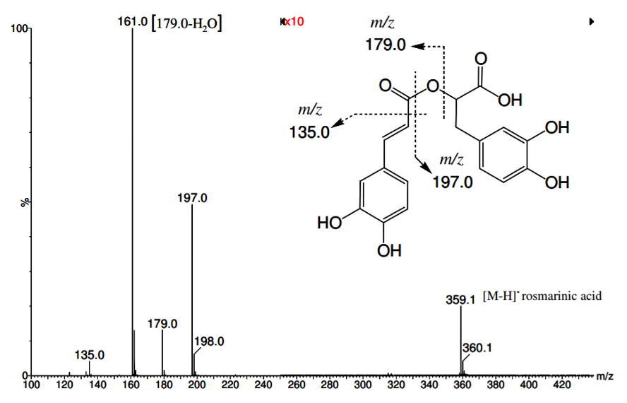

# **1.0 Goals**

The goal of this exercise is to go through XCMS based preprocessing of (untargeted) LC-MS data for Feature Based Molecular Networking (FBMN) on GNPS (<https://gnps.ucsd.edu/ProteoSAFe/static/gnps-splash.jsp>).

# **2.0 Introduction to Feature Based Molecular Networking - FBMN.**

The Feature-Based Molecular Networking (FBMN) workflow is a computational method that bridges popular mass spectrometry data processing tools for LC-MS/MS and molecular networking analysis on [GNPS](http://gnps.ucsd.edu/).

A very complete documentation page for FBMN is available (<https://ccms-ucsd.github.io/GNPSDocumentation/featurebasedmolecularnetworking/>), including the example data and pipelines for all major preprocessing software.

This tutorial is largely based of the data and code presented here (<https://github.com/DorresteinLaboratory/XCMS3_FeatureBasedMN>).

## 2.1 LC-MS and LC-MS/MS Data:

LC-MS data provides data on th relative abundance of each feature in a sample. LC - MS/MS data provide information about the structure of said features. Many pipelines are being developed for annotating LC-MS features based on their MS/MS Spectra.

LC MS/MS data are aquired by isolating a specific mass (parent mass) as it flows through the quadrapole of a mass spectrometer. Isolated masses are then fragmented in the collision cell using varying colision energy. The result is a fragmentation spectra showing the relative abundance of compound fragments.



# 3.0 The FBMN Pipeline

FBMN Pipeline includes the following steps:

1.  XCMS Preprocessing of MS1 and MS2 data:

    a.  Peak picking

    b.  Retention time alignment

    c.  Peak grouping

    d.  Gap filling

    e.  Exporting MS1 and MS2 data

A more detailed version of the XCMS prepossessing steps, including details on how to set key parameter values is available in: [1_Introduction_to_LCMS_preprocessing_with_XCMS.Rmd](https://github.com/dlforrister/Forrister_Metabolomics_WS/blob/main/code/1_Introduction_to_LCMS_preprocessing_with_XCMS.Rmd "1_Introduction_to_LCMS_preprocessing_with_XCMS.Rmd").

### 3.0.1 Exporting required FBMN data

**This pipeline will create the required Data for FBMN from mzML/mzXML files**

**Option A (RECOMMENDED)** - Export the processing results using a feature table and an .MGF file:

1.  A *feature table* with the intensities of LC-MS ion features (TXT or CSV format).

2.  A *MS/MS spectral summary* file with a list of MS/MS spectra associated with the LC-MS ion features (.MGF File). (.MGF file format).

3.  [Optional] *Metadata table* - format described [here](https://ccms-ucsd.github.io/GNPSDocumentation/metadata/)

4.  [Optional] *Original mzML Files* - These are the original files used for feature finding - described [here](https://ccms-ucsd.github.io/GNPSDocumentation/featurebasedmolecularnetworking/#mzml-files-used-for-feature-finding)

5.  [Optional] *"Supplementary Pairs"* of additional edges - described [here](https://ccms-ucsd.github.io/GNPSDocumentation/featurebasedmolecularnetworking/#advanced-extras)

### **3.0.2 Required Packages**

Most packages used in metabolomics are maintained via Bioconductor, and thus need to be installed with "BiocManager"

The analysis in this document requires an R version \>= 4.0.0 and recent versions of the MSnbase and xcms (version \>= 3.11.3 is needed) packages. The packages can be installed with:

```{r packages, include=FALSE}

if (!requireNamespace("BiocManager", quietly=TRUE)) { 
    install.packages("BiocManager")}


if (!requireNamespace("xcms", quietly=TRUE)) {
    BiocManager::install(version='devel')
    BiocManager::install("xcms")}


library(xcms)


#Load required libraries and utility functions for GNPS export.

library(xcms)
source("https://raw.githubusercontent.com/jorainer/xcms-gnps-tools/master/customFunctions.R")


```

In this tutorial we will also use the here package in order to simplify file paths when working with R projects and R markdown files.

```{r filepaths}
if (!require(dplyr)) {install.packages('dplyr')}

library(dplyr)

if (!require(here)) {install.packages('here')}

library(here)
here()
```

### 3.0.3 Socket based parallel processing

Use socket based parallel processing on Windows systems. The number (`4`) defines the number of parallel tasks. Adapt this setting to the number of CPUs available on your system. Also note that it is usually better to not use all CPUs of a system as a) during the analysis the MS data has to be imported from the original mzML/mzXML/CDF files and it will thus be limited by the I/O of the hard disks and b) the computer needs to have enough memory to load the complete MS data of as many raw data files than there are parallel jobs.

```{r}
if (.Platform$OS.type == "unix") {
  register(SerialParam(), default=TRUE)
  #register(bpstart(MulticoreParam(4)))
} else {
  register(bpstart(SnowParam(4)))
}
register(SerialParam())
```

## 3.1 Load Data

In this tutorial we will work through a subset of soil bacteria ([MSV000079204](https://massive.ucsd.edu/ProteoSAFe/dataset.jsp?task=d74ca92d9dec4e2883f28506c670e3ca)).

Load all .mzML files and define sample grouping.

Sample grouping should be adjusted to the actual experimental setup. For the present example analysis we put all files into the same sample group.

```{r}

datafiles <- list.files(here("data", "FBMN_GNPS" ),pattern = ".mzML",full.names = TRUE) 


s_groups <- rep("sample", length(datafiles))
pheno <- data.frame(sample_name = basename(datafiles), 
                    sample_group = s_groups, stringsAsFactors = FALSE)


```

```{r}
head(pheno)
```

Read all raw data, including MS2 level.

```{r}
rawData <- readMSData(datafiles, centroided. = TRUE, mode = "onDisk",
                      pdata = new("NAnnotatedDataFrame", pheno))
```

Create a base peak chromatogram (BPC) of your data for visual inspection.

```{r, fig.width = 12, fig.height - 6, fig.cap = "Base peak chromatogram"}
bpis <- chromatogram(rawData, aggregationFun = "max")
plot(bpis)

```

## 3.2 Peak picking

Define settings for the centWave peak detection.

Perform the chromatographic peak detection.

```{r}

cwp <- CentWaveParam(snthresh = 3, noise = 5000,
                     peakwidth = c(5, 30), ppm = 10)

rawData <- filterEmptySpectra(rawData)
processedData <- findChromPeaks(rawData, param = cwp)

```

Get an overview of the detected peaks, using a heatmap which represents the number of peaks detected for each file along the retention time range.

```{r, fig.width = 10, fig.height = 6}
plotChromPeakImage(processedData, binSize = 10) 
```

## 3.3 Retention time alignment

We skip the retention time adjustment, because the different files have considerable differences in retention time ranges (ranging from 300 to 5000 seconds).

## 3.4 Peak grouping

Define the parameters for the *peak density*-based peak grouping (correspondence analysis).

```{r}

pdp <- PeakDensityParam(sampleGroups = processedData$sample_group,
                        minFraction = 0.10)
processedData <- groupChromPeaks(processedData, param = pdp)

```

## **3.4 Correspondence (Peak Grouping)**

```{r}

pdp <- PeakDensityParam(sampleGroups = processedData$sample_group,
                        minFraction = 0.10)
processedData <- groupChromPeaks(processedData, param = pdp) 

```

## 3.5 Gap filling

Fill-in missing peaks. Peak detection might have failed for some features in some samples. The `fillChromPeaks` function allows to integrate for such cases all signal in the respective m/z - retention time range. Below we first define the median width of identified chromatographic peaks in retention time dimension and use this as parameter `fixedRt` for the `fillChromPeaks`.

```{r}
medWidth <- median(chromPeaks(processedData)[, "rtmax"] -
                   chromPeaks(processedData)[, "rtmin"])
processed_Data <- fillChromPeaks(processedData,
                                 param = FillChromPeaksParam(fixedRt = medWidth))
```

# 4.0 Exporting Data

### 4.1 Export MS Level 2 Data as an MGF File

Below we use the \`featureSpectra\` function to extract all MS2 spectra with their precursor m/z being within the m/z range of a feature/peak and their retention time within the rt range of the same feature/peak. Note that for older \`xcms\` versions (i.e. before version 3.12) \`return.type = "Spectra"\` has to be used instead of \`return.type = "MSpectra"\` as in the example below. Zero-intensity values are removed from each spectrum with the \`clean\` function, and subsequently processed into the expected format using the \`formatSpectraForGNPS\` function.{r}

```{r}
## export the individual spectra into a .mgf file
filteredMs2Spectra <- featureSpectra(processedData, return.type = "MSpectra")
filteredMs2Spectra <- clean(filteredMs2Spectra, all = TRUE)
filteredMs2Spectra <- formatSpectraForGNPS(filteredMs2Spectra)

```

The extracted MS2 spectra are saved as *ms2spectra_all.mgf* file. This file can for example be used to do *in silico* structure prediction through [SIRIUS+CSI:FingerID](https://bio.informatik.uni-jena.de/software/sirius/).

```{r}

writeMgfData(filteredMs2Spectra, here("results","FBMN_GNPS","ms2spectra_all.mgf"))


```

### 4.2 Export MS Level 1 data as a feature abundance table

Export peak area quantification table. To this end we first extract the *feature definitions* (i.e. the m/z and retention time ranges and other metadata for all defined features in the data set) and then the integrated peak areas (with the `featureValues` function). This peak area quantification table contains features and respective per sample peak areas in columns. The combined data is then saved to the file *xcms_all.txt*. Note that it is now also possible to use the entire feature table in the FBMN workflow.

```{r}
## get data
featuresDef <- featureDefinitions(processedData)
featuresIntensities <- featureValues(processedData, value = "into")

## generate data table
dataTable <- merge(featuresDef, featuresIntensities, by=0, all=TRUE)
dataTable <- dataTable[, !(names(dataTable) %in% c("peakidx"))]

```

```{r}

head(dataTable)
```

```{r}
write.table(dataTable, here("results","FBMN_GNPS","xcms_all.txt"), sep = "\t", quote = FALSE, row.names = FALSE)
```

## 4.3 Filter the Data

### 4.3.1 Subset the Feature Abundance Table based on MS2 data

We can subset the peak area quantification table to features for which we have also an MS2 spectrum and export this to the *xcms_onlyMS2.txt* file. This file can be submitted to GNPS [feature-based molecular networking](https://ccms-ucsd.github.io/GNPSDocumentation/featurebasedmolecularnetworking/):

```{r}
## filter data table to contain only peaks with MSMS DF[ , !(names(DF) %in% drops)]
filteredDataTable <- dataTable[which(
    dataTable$Row.names %in% filteredMs2Spectra@elementMetadata$feature_id),]
```

```{r}
head(filteredDataTable)
```

```{r}
write.table(filteredDataTable, here("results","FBMN_GNPS","xcms_onlyMS2.txt"), sep = "\t", quote = FALSE, row.names = FALSE)
```

### 4.3.2 Simplify MS 2 data selecting single spectra for each feature.

#### A - Max TIC for each Feature

The `filteredMs2Spectra` contains all MS2 spectra with their precursor m/z within the feature's m/z range and a retention time that is within the retention time of the chromatographic peak/feature. We thus have multiple MS2 spectra for each feature (also from each sample). Metadata column `"feature_id"` indicates to which feature a MS2 spectrum belongs:

```{r}
filteredMs2Spectra
```

We next select a single MS2 spectrum for each feature and export this reduced set also as an .mgf file. We use the `combineSpectra` function on the list of spectra and specify with `fcol = "feature_id"` how the spectra are grouped (i.e. all spectra with the same feature id are processed together). On the set of spectra of the same feature we apply the `maxTic` function that simply returns the spectrum with the largest sum of intensities. We thus select with the code below the spectrum with the largest total signal as the *representative* MS2 spectrum for each feature.

```{r}
## Select for each feature the Spectrum2 with the largest TIC.
filteredMs2Spectra_maxTic <- combineSpectra(filteredMs2Spectra,
                                            fcol = "feature_id",
                                            method = maxTic)
```

Next we export the data to a file which can then be submitted to GNPS [feature-based molecular networking](https://ccms-ucsd.github.io/GNPSDocumentation/featurebasedmolecularnetworking/).

```{r}
writeMgfData(filteredMs2Spectra_maxTic, here("results","FBMN_GNPS","ms2spectra_maxTic.mgf"))
```

#### B - MS2 consensus spectra

Alternatively, instead of selecting the spectrum with the largest total signal as representative MS2 spectrum for each feature, we can create a *consensus MS2 spectrum*. A consensus MS2 spectrum can for example be created by combining all MS2 spectra for a feature into a single spectrum that contains peaks present in the majority of spectra. Note however that this feature is experimental at present.

To this end we can use the `consensusSpectrum` function in combination with the `combineSpectra` function. The parameter `minProp` defines the mimimal proportion of spectra in which a peak has to be present in order for it to be added to the consensus spectrum (0.8 -\> 80% of spectra). The parameters `mzd` and `ppm` allow to define how to group peaks between spectra with `mzd` being a fixed, constant value and all peaks between spectra with a difference in their m/z \< `mzd` are combined into the final mass peak in the consensus spectrum. Finally, the parameter `ppm` allows to perform an m/z dependent grouping of mass peaks, i.e. mass peaks with a difference in their m/z smaller than `ppm` are combined.

For more details see the documentation of the [consensusSpectrum](https://rdrr.io/bioc/MSnbase/man/consensusSpectrum.html) function in the MSnbase R package.

```{r, message = FALSE, warning = FALSE}
filteredMs2Spectra_consensus <- combineSpectra(
    filteredMs2Spectra, fcol = "feature_id", method = consensusSpectrum,
    mzd = 0, minProp = 0.8, ppm = 10)

writeMgfData(filteredMs2Spectra_consensus, here("results","FBMN_GNPS","ms2spectra_consensus_bacterial.mgf"))
```

Analogously we subset the peak area quantification table to features for which we have an MS2 consensus spectrum and export this to the *xcms_consensusMS2.txt* file. This file can be submitted to GNPS [feature-based molecular networking](https://ccms-ucsd.github.io/GNPSDocumentation/featurebasedmolecularnetworking/):

```{r}
consensusDataTable <- dataTable[which(dataTable$Row.names %in%
                                      filteredMs2Spectra_consensus@elementMetadata$feature_id),]
head(consensusDataTable)
```

```{r}
write.table(consensusDataTable, here("results","FBMN_GNPS","xcms_consensusMS2_bacterial.txt"),
            sep = "\t", quote = FALSE, row.names = FALSE)
```

# 5.0 Next steps and other options

## 5.1 RUN FBMN on GNPS:

The files generated from this pipeline can be uploaded to GNPS and run.

Follow the instructions for running a FBMN Job on GNPS:

<https://ccms-ucsd.github.io/GNPSDocumentation/featurebasedmolecularnetworking/>

## 5.2 It Ion Identity FBMN is possible following this

The **Ion Identity Molecular Networking** (IIMN) workflow complements the [Feature-Based Molecular Networking (FBMN)](https://ccms-ucsd.github.io/GNPSDocumentation/featurebasedmolecularnetworking/) by grouping MS2 spectra not only through similarity of MS2 spectra, but also of MS2 spectra whose precursor ions fulfill the retention time, peak shape, user-defined parameters. It enables the visualization of patterns of ion species and brings together subnetwork from the same molecule to create an ion identity molecular family.

**For IIMN**: Schmid R., Petras D., Nothias LF, et al. [Ion Identity Molecular Networking for mass spectrometry-based metabolomics in the GNPS Environment](https://www.nature.com/articles/s41467-021-23953-9). Nat. Comm. 12, 3832 (2021).

This can be done using the XCMS add on Camera.

Tutorial code modified from (<https://github.com/DorresteinLaboratory/XCMS3_FeatureBasedMN/blob/master/XCMS3_Preprocessing.Rmd>)

**CAMERA annotation of adducts and isotopes**

The code in this section describes how the data can be processed to enable the ion identify networking (IIN) in FBMN. In brief, we are using the \`CAMERA\` package to determine which features might be adducts or isotopes of the same compound. This information is exported as an additional \*edges\* file and is added to the feature annotation..

Note: the CAMERA package supports objects of class \`xcmsSet\`, which were the outputs of the \*old\* version of xcms. The newer \`XCMSnExp\` object can however be converted to an \`xcmsSet\` object with the \`as(object, "xcmsSet")\`, which does however not support conversion of objects with MS level \> 1 data. Thus we use the \`filterMsLevel\` function on the result object to restrict the data in the object to MS level 1 prior to the conversion.

```{r}

if (!requireNamespace("CAMERA", quietly=TRUE)) { 
    BiocManager::install("CAMERA")}

library(CAMERA)


xset <- as(filterMsLevel(processedData, msLevel = 1L), "xcmsSet")
```

With the conversion we lost also the sample group assignment which we have to manually add.

```{r, message = FALSE}
sampclass(xset) <- s_groups

```

Create and \`xsAnnotate\` object named \`xsa\` extracting the peak table from the \`xcmsSet\` object named \`xset\`. Parameter \`polarity\` can be either \`"positive"\` or \`"negative"\`, depending on the polarity in which the data was acquired.

```{r}

xsa <- xsAnnotate(xset, polarity = "positive")

```

The following worflow can be divided in 2 big steps: (1) feature grouping into \*pseudospectras\* and (2) annotate the ion species.

The first step has the aim to group the chromatographic peaks from the same metabolite (but for potentially different adducts/ions of it). We thus first group peaks of the \`xsAnnotate\` object (\`xsa\`) with a similar retention time (i.e. co-eluting peaks). Parameter \`perfwhm\` allows to define the percentage of the width of the FWHM (full width at half maximum). For data sets with a higher variation in retention times this values should be increased.

```{r}
xsaF <- groupFWHM(xsa, sigma = 6, perfwhm = 1) 
```

In this example, this step has generated 283 pseudospectra.

Then, we verify/clean-up the peak grouping by correlating the peak shape of features clustered in the same pseudospectra group (in order to separate co-eluting metabolites). Peaks with correlations lower than \`cor_eic_th\` are separated into different groups. Parameters \`calcCiS\`, \`calcCaS\` and \`calcIso\` allow to specify whether correlations should be performed within the same sample (the default), across samples or whether isotope detection information should be included for graph clustering. We use the default values here, but this should be adapted to the respective experimental setup (e.g. setting \`calcSaS = TRUE\` if it can be assumed that the same adducts are generated across all samples in the data set).

```{r, message = FALSE}
xsaC <- groupCorr(xsaF, cor_eic_th = 0.6, pval = 0.05, graphMethod = "hcs",
                  calcCiS = TRUE, calcCaS = TRUE, calcIso = FALSE)
```

This step has seperated our 283 pseudospectra into 2132.

Now we are going to deal with the second big step of CAMERA workflow: annotation of isotopes and adducts within pseudospectra-groups. The \`findIsotopes\` annotates isotopes according to the relation between features' C12/C13. Parameter \`intval\` allows to specify which feature value should be uses (\`"into"\` for the maximum peak intensity, \`"into"\` for the integrated peak intensity and \`"intb"\` for the baseline corrected integrated peak intensity, which might not be available for all peak detection methods). Parameters \`maxcharge\` and \`maxiso\` allow to specify the maximal number of isotope charge and isotope peaks, respectively.

```{r}

xsaFI <- findIsotopes(xsaC, maxcharge = 2, maxiso = 3, minfrac = 0.5, ppm = 10, intval = "maxo")

```

Next adducts are identified and annotated based on the m/z differences between grouped chromatographic peaks. Setting the correct polarity with parameter \`polarity\` (either \`"positive"\` or \`"negative"\` is key). For potential adducts, \`CAMERA\` calculates by default all possible combinations from the standard ions depending on the ionization mode. Alternatively it is possible to limit to a predefined set of adducts with the \`rules\` parameter.

```{r, message = FALSE}
xsaFA <- findAdducts(xsaFI, polarity = "positive", 
                     max_peaks = 100, multiplier = 3, ppm = 10)
```

Sometimes CAMERA is grouping features of different co-eluting metabolites. It might be helpful to evaluate whether peaks from the same group have different peak shapes. Parameter `pspec` allows to specify from which group (column `"pcgroup"`) the data should be plotted.

```{r, message = FALSE}
plotEICs(xsaFA, maxlabel = 5, pspec = 26)
```

Next we extract the *edge list* from the `CAMERA` result object with the `getEdgelist` function (defined in [xcms-gnps-tools](https://github.com/jorainer/xcms-gnps-tools)).

```{r}
edgelist <- getEdgelist(xsaFA)
```

The resulting `data.frame` contains an edge between nodes (i.e. pairwise associations between potential adducts/isotopes from the same *correlation group* defined by `CAMERA`) in each row. All edges fulfill the criteria from `CAMERA` (i.e. representing signal from co-eluting ions with a similar peak shape), but only for few the actual adduct annotation could be determined (see below).

```{r}
edgelist[1:8, ]
```

For features that are adducts or isotopes of the same compound the edge table contains the value `"MS1 annotation"` in column `"EdgeType"`. This information can be used to e.g. subset the edges table to contain only edges for features with adduct or isotope annotations. Below we show the first 6 edges with such annotation.

```{r}
head(edgelist[edgelist$EdgeType == "MS1 annotation", ])
```

In addition we extract per-feature annotations from the `CAMERA` result object with the `getFeatureAnnotations` function (also defined in [xcms-gnps-tools](https://github.com/jorainer/xcms-gnps-tools)). These are appended to the feature table `dataTable` generated in the previous section.

```{r message = FALSE}
camera_feature_ann <- getFeatureAnnotations(xsaFA)
dataTable <- cbind(dataTable, camera_feature_ann)
```

At last we export the edgelist containing all edges with adduct or isotope annotation to the file *camera_iin_edgelist.csv* and the feature annotation and quantification table to *xcms_all.txt*. These can be used as input for the Ion Identity Networking (IIN) in GNPS.

```{r}
edgelist_sub <- edgelist[edgelist$Annotation != "", ]
write.csv(edgelist_sub, file = here("results","FBMN_GNPS","camera_iin_edgelist.csv"), row.names = FALSE,quote = FALSE, na = "")
write.table(dataTable, file = here("results","FBMN_GNPS","xcms_all.txt"),
            row.names = FALSE, quote = FALSE, sep = "\t", na = "")
```
